# Contents

The module `SpinGlassPEPS.jl` re-exports all following functionality.

## SpinGlassTensors
`SpinGLassTensors` is a collection of many auxiliary functions.
* `base.jl` - provides auxiliary functions to check MPS properties
* `compressions.jl` - an interface to truncate, canonise, compress MPS variationally and prepare left or right environment of MPS.
* `contractions.jl` - offers auxiliary functions to contract the tensor network and calculate the dot product of MPS and MPO. 
* `identities.jl` - 
* `linear_algebra_ext.jl` - wraper to QR and SVD

### Compressions
#### update env left
    (LE::S, M::T, ::Val{:n}) where {S <: AbstractArray{Float64, 3}, T <: AbstractDict}
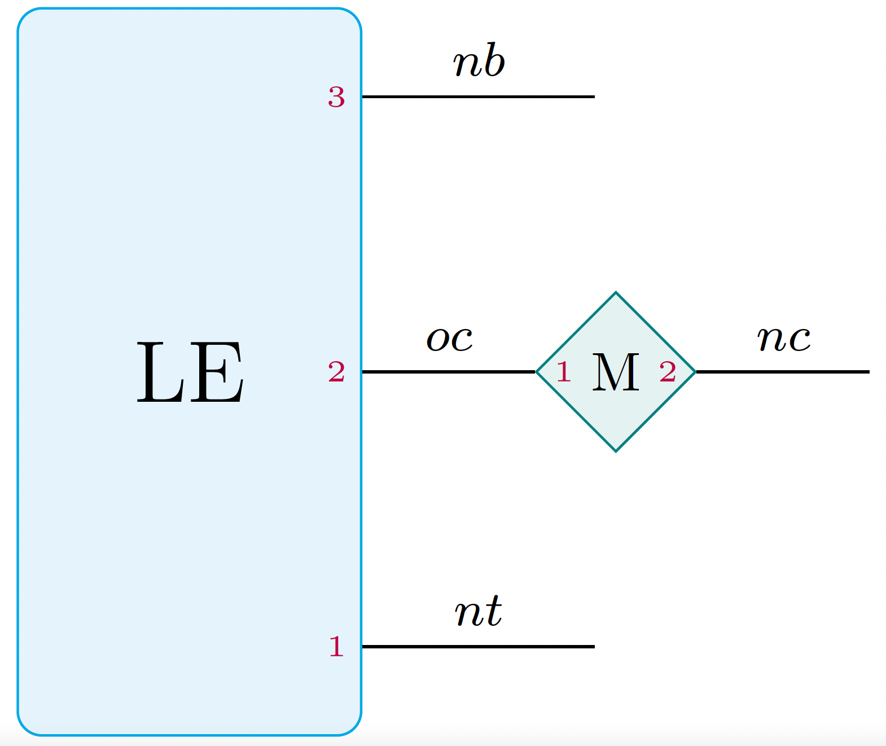

#### update env left
    (LE::S, A::S, M::T, B::S, ::Val{:n}) where {S <: AbstractArray{Float64, 3}, T <: AbstractArray{Float64, 4}}
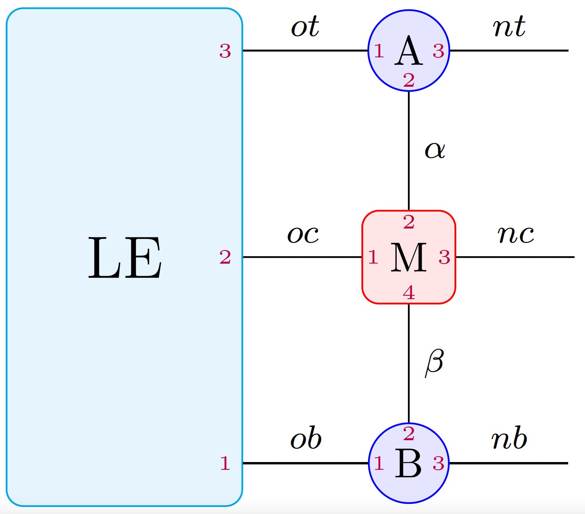

#### update env left
    (LE::S, A::S, M::T, B::S, ::Val{:c}) where {S <: AbstractArray{Float64, 3}, T <: AbstractArray{Float64, 4}}
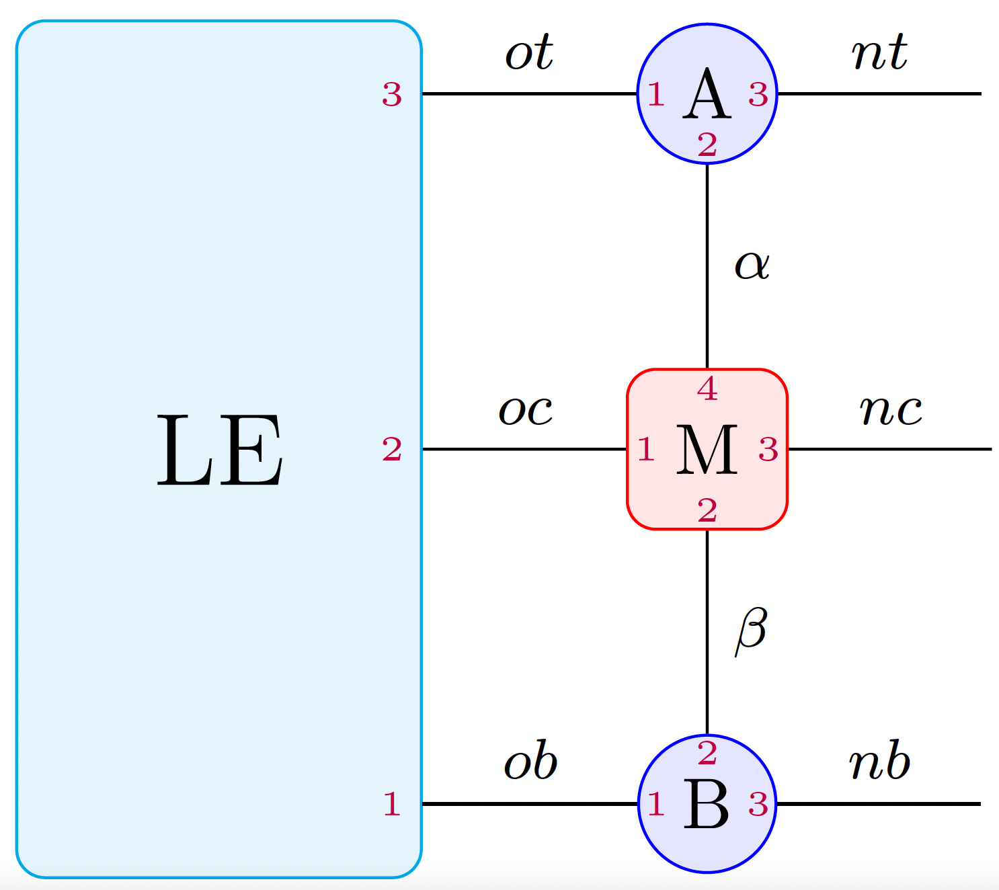

#### update env right
    (RE::S, M::T, ::Val{:c}) where {S <: AbstractArray{Float64, 3}, T <: AbstractDict}
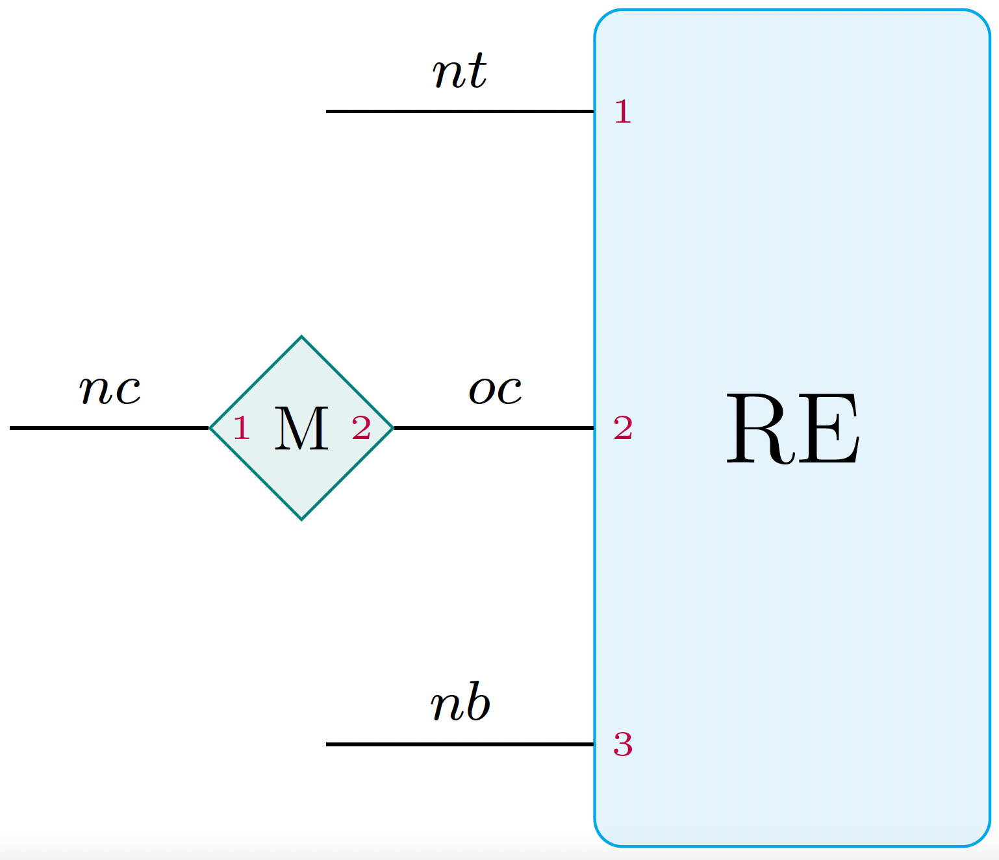

#### update env right
    (RE::S, A::S, M::T, B::S, ::Val{:n}) where {T <: AbstractArray{Float64, 4}, S <: AbstractArray{Float64, 3}}
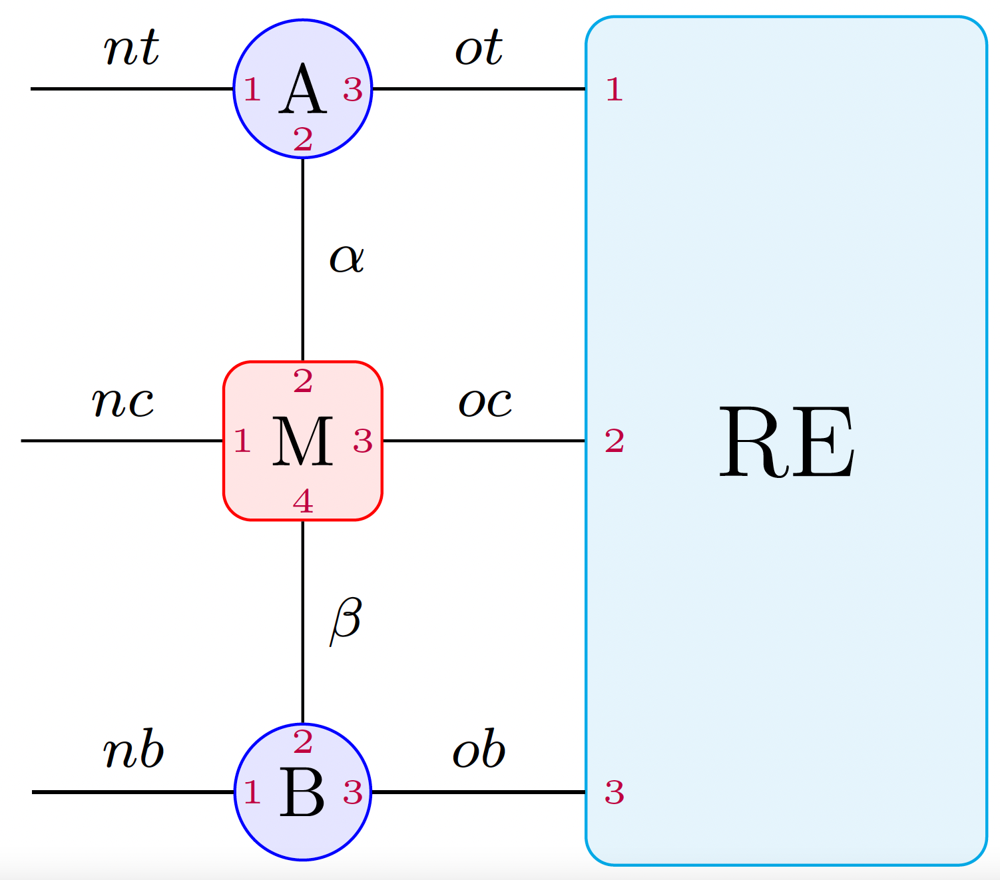

#### update env right 
    (RE::S, A::S, M::T, B::S, ::Val{:c}) where {T <: AbstractArray{Float64, 4}, S <: AbstractArray{Float64, 3}}
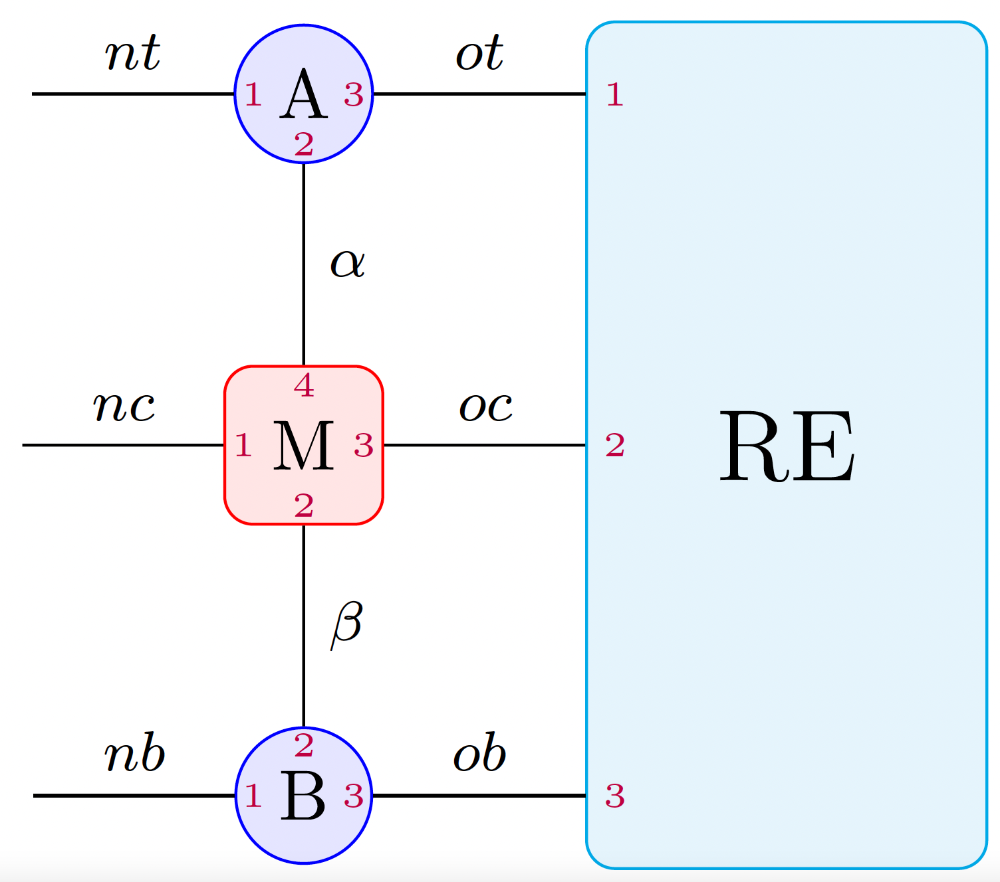

#### update tensor forward
    (A::S, M::T, sites, ::Val{:n}) where {S <: AbstractArray{Float64, 3}, T <: AbstractDict}
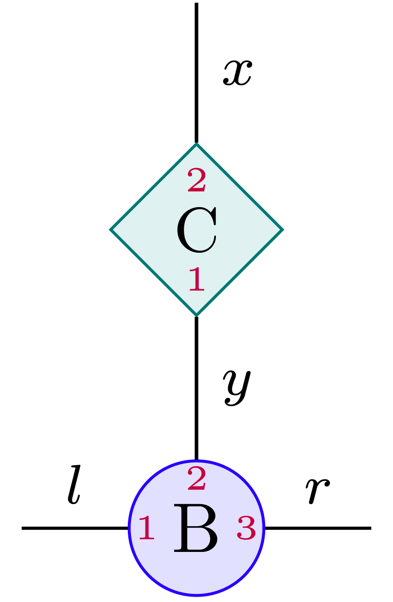

#### update tensor forward
    (A::S, M::T, sites, ::Val{:c}) where {S <: AbstractArray{Float64, 3}, T <: AbstractDict}
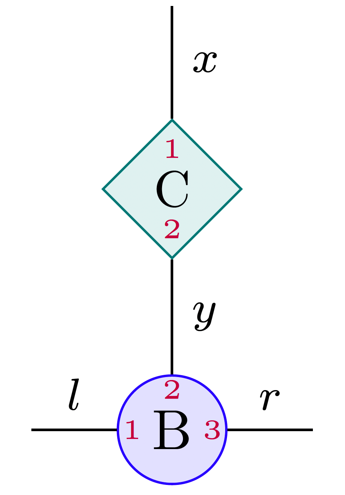

#### project ket on bra
    (LE::S, B::S, M::T, RE::S, ::Val{:n}) where {T <: AbstractArray{Float64, 4}, S <: AbstractArray{Float64, 3}}
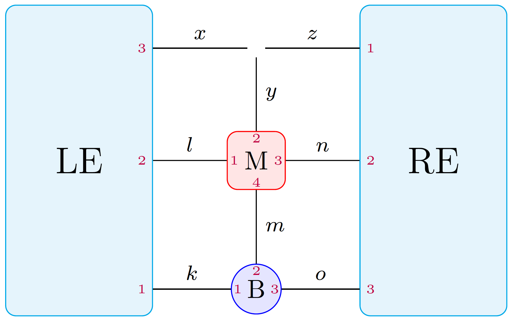

#### project ket on bra
    (LE::S, B::S, C::S, M::T, N::T, RE::S, ::Val{:n}) where {T <: AbstractArray{Float64, 4}, S <: AbstractArray{Float64, 3}}
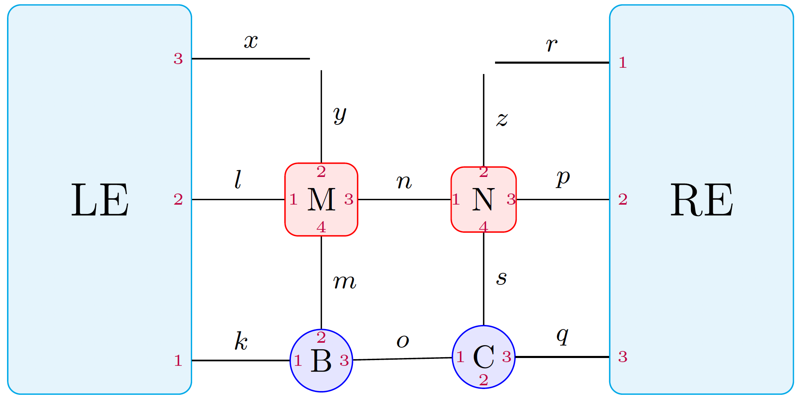

#### project ket on bra
    (LE::S, B::S, M::T, RE::S, ::Val{:c}) where {T <: AbstractArray{Float64, 4}, S <: AbstractArray{Float64, 3}}
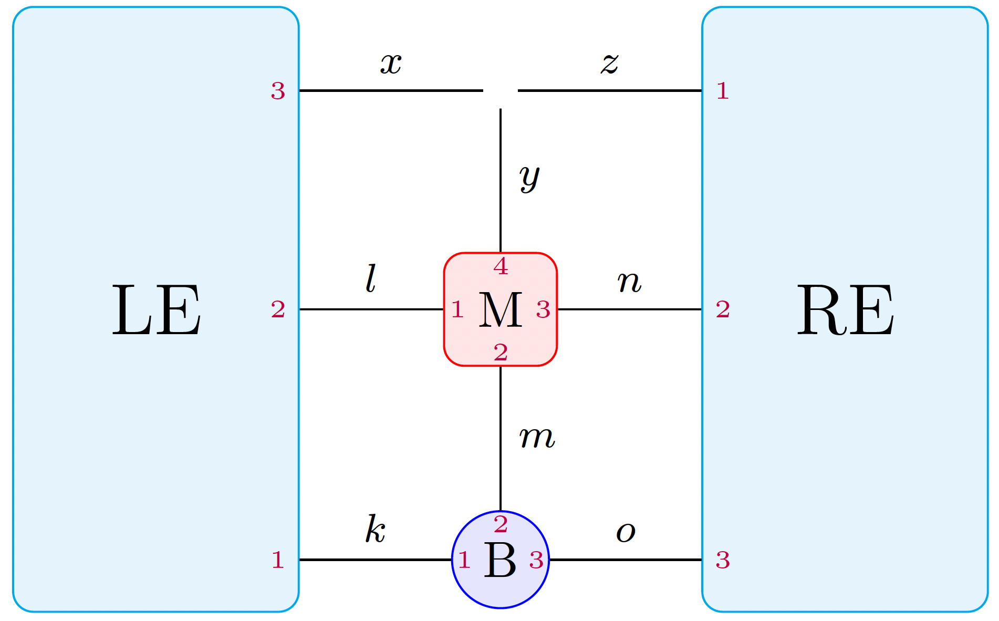

#### project ket on bra
    (LE::S, B::S, C::S, M::T, N::T, RE::S, ::Val{:c}) where {T <: AbstractArray{Float64, 4}, S <: AbstractArray{Float64, 3}}
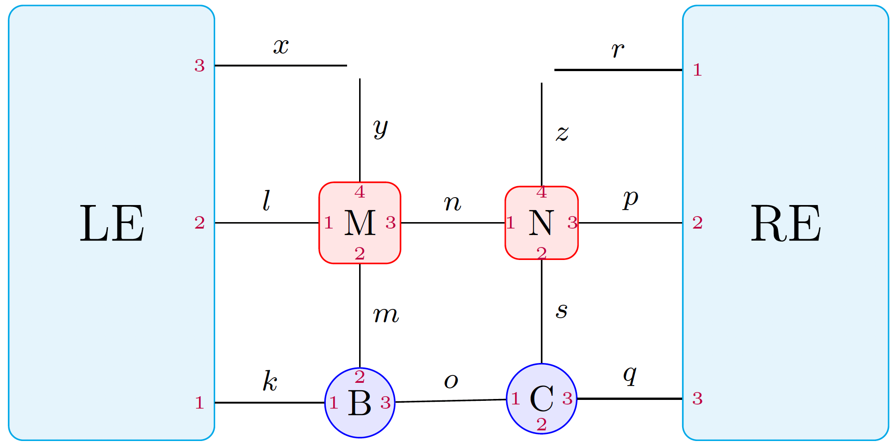

## SpinGlassNetworks
* `factor.jl` - introduces factor graph
* `ising.jl` - creates the Ising spin glass model
```@docs
SpinGlassNetworks.ising_graph
```
* `lattice.jl` - forms a square lattice
* `spectrum.jl` - is a collection of functions to calculate low energy spectrum. Enables to compute Ising energy and Gibbs state for classical Ising Hamiltonian.
```@docs
SpinGlassTensors.left_env
```
```@docs
SpinGlassNetworks.energy
```
* `states.jl`

## SpinGlassEngine
`SpinGlassEngine` is a main module of the package `SpinGlassPEPS` which allows for searching for the low energy spectrum using branch and bound algorithm.
* `MPS_search.jl` - searching for the low energy spectrum on quasi-1d graph
* `PEPS.jl` - introduces PEPS tensor network and contracts it using boundary matrix product state approach
* `search.jl` - searching for the low-energy spectrum on a quasi-2d graph