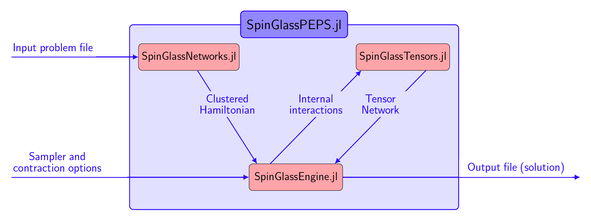
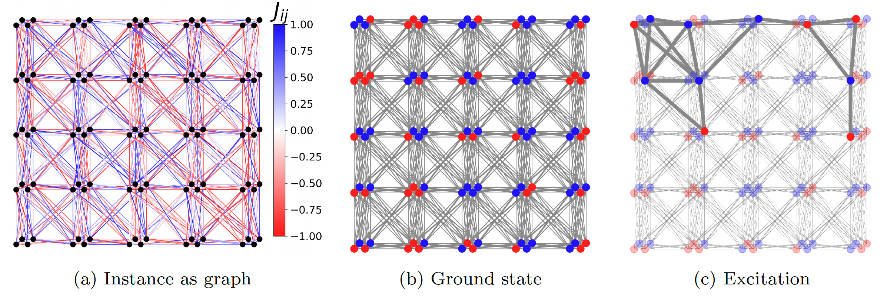

```@meta
Author = "Tomasz Śmierzchalski, Anna M. Dziubyna, Konrad Jałowiecki, Zakaria Mzaouali, Łukasz Pawela, Bartłomiej Gardas and Marek M. Rams"
```

# Welcome to SpinGlassPEPS.jl documentation!

Welcome to `SpinGlassPEPS.jl`, a open-source Julia package designed for heuristically solving Ising-type optimization problems defined on quasi-2D lattices and Random Markov Fields on 2D rectangular lattices.

!!! info "Star us on GitHub!" 
    If you have found this library useful, please consider starring the GitHub repository. This gives us an accurate lower bound of the satisfied users.


## Overview
In this section we will provide a condensed overview of the package.

`SpinGlassPEPS.jl` is a collection of Julia packages bundled together under a single package `SpinGlassPEPS.jl`. It can be installed using the Julia package manager for Julia v1.6 and higher. Inside the Julia REPL, type ] to enter the Pkg REPL mode and then run
```julia
using Pkg; 
Pkg.add("SpinGlassPEPS")
```
The package `SpinGlassPEPS.jl` includes:
* `SpinGlassEngine.jl` - Package containing the solver itself and tools focused on finding and operating on excitations. 
* `SpinGlassNetworks.jl` - Package containing all tools needed to construct an Ising graph from a given instance and create Potts Hamiltonian.
* `SpinGlassTensors.jl` - Package containing all necessary functionalities for creating and operating on tensors. It allows the use of both CPU and GPU.

```@raw html

```

## Our goals

`SpinGlassPEPS.jl` was created to heuristically solve Ising-type optimization problems defined on quasi-2D lattices or Random Markov Fields (RMF) on 2D rectangular lattices. This package combines advanced heuristics to address optimization challenges and employs tensor network contractions to compute conditional probabilities to identify the most probable states according to the Gibbs distribution. `SpinGlassPEPS.jl` is a tool for reconstructing the low-energy spectrum of Ising spin glass Hamiltonians and RMF Hamiltonians. Beyond energy computations, the package offers insights into spin configurations, associated probabilities, and retains the largest discarded probability during the branch and bound optimization procedure. Notably, `SpinGlassPEPS.jl` goes beyond ground states, introducing a feature for identifying and analyzing spin glass droplets — collective excitations crucial for understanding system dynamics beyond the fundamental ground state configurations. 
```@raw html

```

## Citing SpinGlassPEPS.jl
If you use `SpinGlassPEPS.jl` for academic research and wish to cite it, please use the following paper:

Tomasz Śmierzchalski, Anna M. Dziubyna, Konrad Jałowiecki, Zakaria Mzaouali, Łukasz Pawela, Bartłomiej Gardas and Marek M. Rams, 
*“SpinGlassPEPS.jl: low-energy solutions for near-term quantum annealers"*

## Contributing
Contributions are always welcome:
* Please report any issues and bugs that you encounter in Issues
* Questions about `SpinGlassPEPS.jl` can be asked by directly opening up an Issue on its GitHub page
* If you plan to contribute new features, extensions, bug fixes, etc, please first open an issue and discuss the feature with us.

!!! info "Report the bug" 
    Filling an issue to report a bug, counterintuitive behavior, or even to request a feature is extremely valuable in helping us prioritize what to work on, so don't hestitate.

