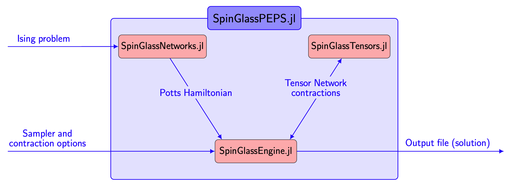
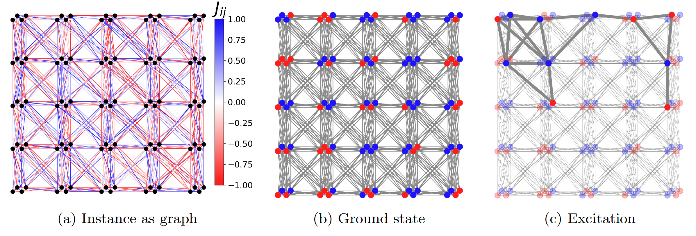

# Welcome to SpinGlassPEPS.jl documentation!

Welcome to `SpinGlassPEPS.jl`, a open-source Julia package designed for heuristically solving Ising-type optimization problems defined on quasi-2D lattices.

!!! info "Star us on GitHub!" 
    If you have found this library useful, please consider starring the GitHub repository. This gives us an accurate lower bound of the satisfied users.


## Overview
In this section we will provide a condensed overview of the package.

`SpinGlassPEPS.jl` is one Julia package containing the complete solver stack. It supports
Julia 1.11 and can be installed from the package prompt with
```julia
using Pkg; 
Pkg.add("SpinGlassPEPS")
```
`SpinGlassPEPS.jl` is distributed as one package. Internally, its source is organized into
four modules: model and lattice construction, tensor operations, the PEPS solver, and
exhaustive-search routines. All public functionality is available after a single
`using SpinGlassPEPS`; the components do not need to be installed or loaded separately.

```@raw html

```

## Our goals

`SpinGlassPEPS.jl` was created to heuristically solve Ising-type optimization problems defined on quasi-2D lattices. This package combines advanced heuristics to address optimization challenges and employs tensor network contractions to compute conditional probabilities to identify the most probable states according to the Gibbs distribution. `SpinGlassPEPS.jl` is a tool for reconstructing the low-energy spectrum of Ising spin glass Hamiltonians and some more general Potts Hamiltonians. Beyond energy computations, the package offers insights into spin configurations, associated probabilities, and retains the largest discarded probability during the branch and bound optimization procedure. Notably, `SpinGlassPEPS.jl` goes beyond ground states, introducing a feature for reconstructing the low-energy spectrum from identified localized excitations in the system, called spin-glass droplets.
```@raw html

```

## Citing SpinGlassPEPS.jl
If you use `SpinGlassPEPS.jl` for academic research and wish to cite it, please use the following papers:

* Article describing this package and code.
```
@article{SpinGlassPEPS.jl,
    author = {Tomasz \'{S}mierzchalski and Anna Maria Dziubyna and Konrad Ja\l{}owiecki and Zakaria
    Mzaouali and {\L}ukasz Pawela and Bart\l{}omiej Gardas and Marek M. Rams},
    title = {{SpinGlassPEPS.jl}: Tensor-network package for {Ising}-like optimization on quasi-two-dimensional graphs},
    journal = {SoftwareX},
    volume = {31},
    pages = {102257},
    year = {2025},
    doi = {10.1016/j.softx.2025.102257},
}
```

* Article describing in details used algorithms and containing extensive benchmarks.
```
@article{SpinGlassPEPS, 
    author = {Anna Maria Dziubyna and Tomasz \'{S}mierzchalski and Bart\l{}omiej Gardas and Marek M. Rams and Masoud Mohseni},
    title = {Limitations of tensor network approaches for optimization and sampling: A comparison against quantum and classical {Ising} machines},
    journal = {Physical Review Applied},
    volume = {23},
    pages = {054049},
    year = {2025},
    doi = {10.1103/PhysRevApplied.23.054049},
}
```


## Contributing
Contributions are always welcome:
* Please report any issues and bugs that you encounter in Issues
* Questions about `SpinGlassPEPS.jl` can be asked by directly opening up an Issue on its GitHub page
* If you plan to contribute new features, extensions, bug fixes, etc, please first open an issue and discuss the feature with us.

!!! info "Report the bug" 
    Filling an issue to report a bug, counterintuitive behavior, or even to request a feature is extremely valuable in helping us prioritize what to work on, so don't hestitate.
