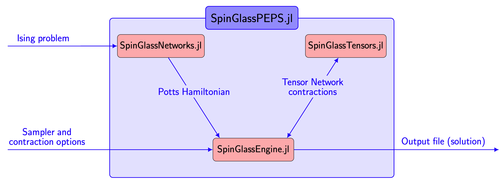

```@meta
Author = "Tomasz Śmierzchalski, Anna M. Dziubyna, Konrad Jałowiecki, Zakaria Mzaouali, Łukasz Pawela, Bartłomiej Gardas and Marek M. Rams"
```

# Welcome to SpinGlassPEPS.jl documentation!

Welcome to `SpinGlassPEPS.jl`, a open-source Julia package designed for heuristically solving Ising-type optimization problems defined on quasi-2D lattices.

!!! info "Star us on GitHub!" 
    If you have found this library useful, please consider starring the GitHub repository. This gives us an accurate lower bound of the satisfied users.


## Overview
In this section we will provide a condensed overview of the package.

`SpinGlassPEPS.jl` is a collection of Julia packages bundled together under a single package `SpinGlassPEPS.jl`. It can be installed using the Julia package manager for Julia v1.10 (TODO: update to Julia v1.11). Inside the Julia REPL, type ] to enter the Pkg REPL mode and then run
```julia
using Pkg; 
Pkg.add("SpinGlassPEPS")
```
The package `SpinGlassPEPS.jl` includes three independent sub-packages:
* `SpinGlassEngine.jl` -  serves as the core package, consisting of routines for executing the branch-and-bound method (with the ability to leverage the problem's locality) for a given Potts instance. It also includes capabilities for reconstructing the low-energy spectrum from identified localized excitations and provides a tensor network constructor. 
* `SpinGlassNetworks.jl` - facilitates the generation of an Ising graph from a given instance using a set of standard inputs (e.g., instances compatible with the Ocean environment provided by D-Wave) and supports clustering to create effective Potts Hamiltonians.
* `SpinGlassTensors.jl` - offers essential tools for creating and manipulating tensors that constitute the PEPS network, with support for both CPU and GPU utilization. It manages core operations on tensor networks, including contraction, using the boundary Matrix Product State approach. This package primarily functions as a backend, and users generally do not interact with it directly.

```@raw html

```

## Our goals

`SpinGlassPEPS.jl` was created to heuristically solve Ising-type optimization problems defined on quasi-2D lattices. This package combines advanced heuristics to address optimization challenges and employs tensor network contractions to compute conditional probabilities to identify the most probable states according to the Gibbs distribution. `SpinGlassPEPS.jl` is a tool for reconstructing the low-energy spectrum of Ising spin glass Hamiltonians and some more general Potts Hamiltonians. Beyond energy computations, the package offers insights into spin configurations, associated probabilities, and retains the largest discarded probability during the branch and bound optimization procedure. Notably, `SpinGlassPEPS.jl` goes beyond ground states, introducing a feature for reconstructing the low-energy spectrum from identified localized excitations in the system, called spin-glass droplets.
```@raw html

```

## Citing SpinGlassPEPS.jl
If you use `SpinGlassPEPS.jl` for academic research and wish to cite it, please use the following papers:

* Article describing this package and code.
```
@article{SpinGlassPEPS.jl,
    author = {Tomasz \'{S}mierzchalski and Anna Maria Dziubyna and Konrad Ja\l{}owiecki and Zakaria
    Mzaouali and {\L}ukasz Pawela and Bart\l{}omiej Gardas and Marek M. Rams},
    title = {{SpinGlassPEPS.jl}: low-energy solutions for near-term quantum annealers},
    journal = {},
    year = {},
}
```

* Article describing in details used algorithms and containing extensive benchmarks.
```
@misc{SpinGlassPEPS, 
    author = {Anna Maria Dziubyna and Tomasz \'{S}mierzchalski and Bart\l{}omiej Gardas and Marek M. Rams and Masoud Mohseni},
    title = {Limitations of tensor network approaches for optimization and sampling: A comparison against quantum and classical {Ising} machines},
    year = {2024},
    eprint={2411.16431},
    archivePrefix={arXiv},
    primaryClass={cond-mat.dis-nn},
    doi = {10.48550/arXiv.2411.16431} 
}
```


## Contributing
Contributions are always welcome:
* Please report any issues and bugs that you encounter in Issues
* Questions about `SpinGlassPEPS.jl` can be asked by directly opening up an Issue on its GitHub page
* If you plan to contribute new features, extensions, bug fixes, etc, please first open an issue and discuss the feature with us.

!!! info "Report the bug" 
    Filling an issue to report a bug, counterintuitive behavior, or even to request a feature is extremely valuable in helping us prioritize what to work on, so don't hestitate.

