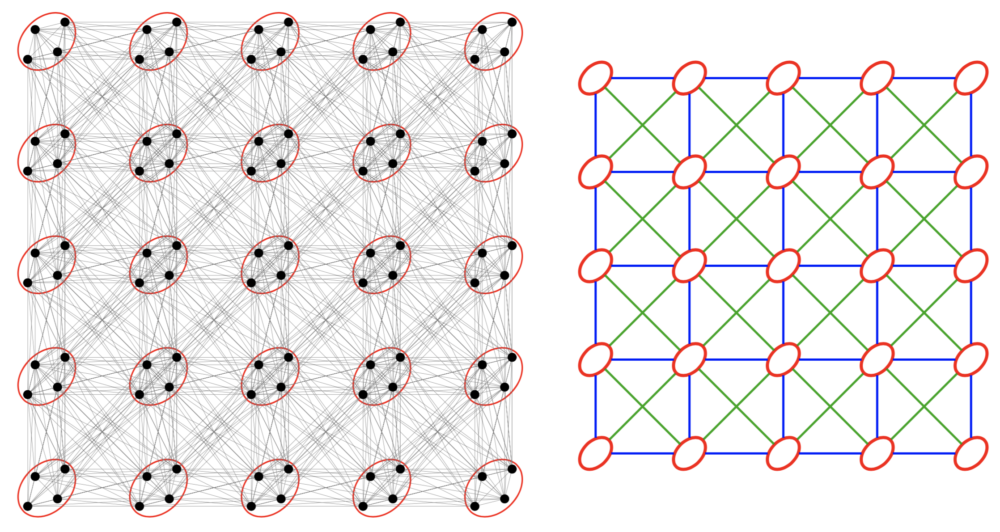
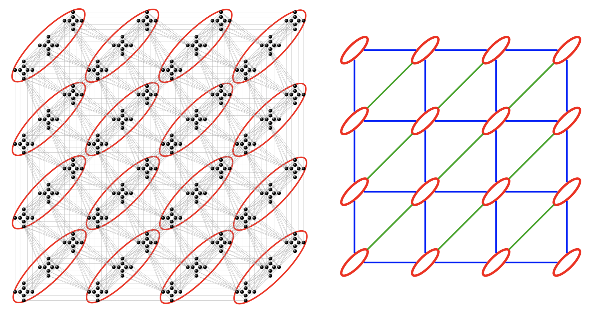

# Lattice geometries
The Ising graph allowed for loading instances directly from a file and translating them into a graph. The next step towards constructing the tensor network is to build a lattice, based on which we will transform the Ising graph into a Potts Hamiltonian.
Within the `SpinGlassNetworks.jl` package, users have the flexibility to construct three types of lattice geometries, each tailored to specific needs. 

## Super square lattice
The `super_square_lattice` geometry represents a square lattice with nearest neighbors interactions (horizontal and vertical interactions between unit cells) and next nearest neighbor interactions (diagonal interactions). Unit cells depicted on the schematic picture below as red ellipses can consist of multiple spins.
This geometry allows for an exploration of spin interactions beyond the traditional square lattice framework. 
```@raw html

```

In `SpinGlassPEPS.jl` solver, a grid of this type can be loaded using the command `super_square_lattice`.

```@docs
super_square_lattice
```

Below you find simple example of usage `super_square_latttice` function.

```@example
using SpinGlassEngine, SpinGlassNetworks, LabelledGraphs

instance = "$(@__DIR__)/../../src/instances/square_diagonal/5x5/diagonal.txt"
ig = ising_graph(instance)

m = 5
n = 5
t = 4

potts_h = potts_hamiltonian(
    ig,
    cluster_assignment_rule = super_square_lattice((m, n, t))
)

println("Number of nodes in original instance: ", length(LabelledGraphs.vertices(ig)), "\n", " Number of nodes in Potts Hamiltonian: ", length(LabelledGraphs.vertices(potts_h)))
```

## Pegasus graphs
The Pegasus graph is a type of graph architecture used in quantum computing systems, particularly in the quantum annealing machines developed by D-Wave Systems. It is designed to provide a grid of qubits with specific connectivity patterns optimized for solving certain optimization problems. Futer details can be found [here](https://docs.dwavesys.com/docs/latest/c_gs_4.html#pegasus-graph).
```@raw html

```

In `SpinGlassPEPS.jl` solver, a grid of this type can be loaded using the command `pegasus_lattice`.

```@docs
pegasus_lattice
```

Below you find simple example of usage `pegasus_latttice` function.

```@example
using SpinGlassEngine, SpinGlassNetworks, LabelledGraphs

# load Pegasus instance and create Ising graph
instance = "$(@__DIR__)/../../src/instances/pegasus_random/P4/RAU/001_sg.txt"
ig = ising_graph(instance)

# Loaded instance is compatible with Pegasus geometry. Next we create Potts hamiltonian based on Pegasus geometry. 
m = 3
n = 3
t = 3

potts_h = potts_hamiltonian(
    ig,
    cluster_assignment_rule = pegasus_lattice((m, n, t))
)

println("Number of nodes in original instance: ", length(LabelledGraphs.vertices(ig)), "\n", " Number of nodes in Potts Hamiltonian: ", length(LabelledGraphs.vertices(potts_h))/2)
```


## Zephyr graphs
The Zephyr graph is a type of graph architecture used in quantum computing systems, particularly in the quantum annealing machines developed by D-Wave Systems. Futer details can be found [here](https://docs.dwavesys.com/docs/latest/c_gs_4.html#zephyr-graph).
```@raw html

```

In `SpinGlassPEPS.jl` solver, a grid of this type can be loaded using the command `zephyr_lattice`.

```@docs
zephyr_lattice
```

Below you find simple example of usage `zephyr_latttice` function.

```@example
using SpinGlassEngine, SpinGlassNetworks, LabelledGraphs

# load instance and create Ising graph
instance = "$(@__DIR__)/../../src/instances/zephyr_random/Z3/RAU/001_sg.txt"
ig = ising_graph(instance)

# Loaded instance is compatible with Zephyr geometry. Next we create Potts hamiltonian based on Zephyr geometry. 
m = 6
n = 6
t = 4

potts_h = potts_hamiltonian(
    ig,
    cluster_assignment_rule = zephyr_lattice((m, n, t))
)

println("Number of nodes in original instance: ", length(LabelledGraphs.vertices(ig)))
```