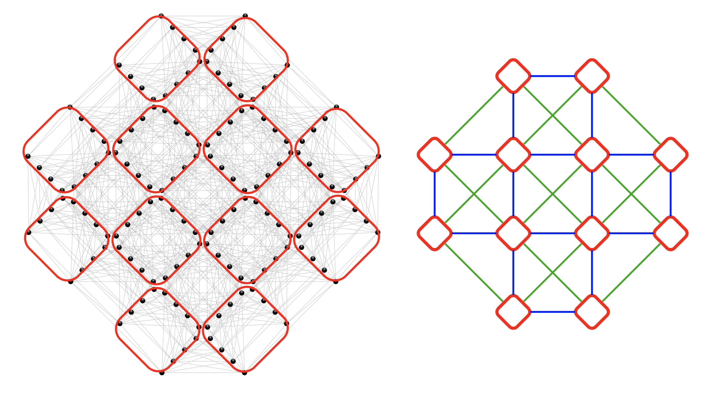

# Lattice geometries
The Ising graph serves as the starting point, allowing users to load instances directly from a file and translate them into a graph with vertices numerated using linear indices. To group spins into clusters for the Potts Hamiltonian, it is necessary to map these linear spin coordinates onto the corresponding coordinates of a Potts clusters in a specific lattice geometry. 

The `SpinGlassNetworks.jl` package provides tools for mapping linear indices into three types of lattice geometries, enabling users to adapt the mapping process to the structure of the problem being analyzed. These geometries include super square lattice, Pegasus lattice, and Zephyr lattice, each optimized for specific topologies and applications. For example, in the Pegasus lattice, groups of 24 binary spins are clustered into a single Potts variable, while in the Zephyr lattice, clusters consist of 16 binary spins. 

## Super square lattice
The `super_square_lattice` geometry defines a square lattice with interactions between nearest neighbors (horizontal and vertical connections between unit cells) and next-nearest neighbors (diagonal connections). In `super_square_lattice` function, linear indices of spins from the Ising graph are mapped onto a 2D super square lattice coordinate system (King's lattice). 
Spins (denoted as black dots in the figure below) are grouped into clusters represented as red ellipses. Every spin in this cluster is indexed coresponding to the square lattice coordinate in the new graph with reduced number of variables of higher dimensions (shown on the right).
```@raw html

```

In `SpinGlassPEPS.jl` solver, a grid of this type can be loaded using the command `super_square_lattice`.

```@docs
super_square_lattice
```

Below you find simple example of usage `super_square_latttice` function.

```@example
using SpinGlassEngine, SpinGlassNetworks, LabelledGraphs

instance = "$(@__DIR__)/../../src/instances/square_diagonal/5x5/diagonal.txt"
ig = ising_graph(instance)

m = 5
n = 5
t = 4

potts_h = potts_hamiltonian(
    ig,
    cluster_assignment_rule = super_square_lattice((m, n, t))
)

println("Number of nodes in original instance: ", length(LabelledGraphs.vertices(ig)), "\n", " Number of nodes in Potts Hamiltonian: ", length(LabelledGraphs.vertices(potts_h)))
```

## Pegasus graphs
The Pegasus graph is a type of graph architecture used in quantum computing systems, particularly in the quantum annealing machines developed by D-Wave Systems. It is designed to provide a grid of qubits with specific connectivity patterns optimized for solving certain optimization problems. Futer details can be found [here](https://docs.dwavesys.com/docs/latest/c_gs_4.html#pegasus-graph).
```@raw html

```

In `SpinGlassPEPS.jl` solver, a grid of this type can be loaded using the command `pegasus_lattice`.

```@docs
pegasus_lattice
```

Below you find simple example of usage `pegasus_latttice` function.

```@example
using SpinGlassEngine, SpinGlassNetworks, LabelledGraphs

# load Pegasus instance and create Ising graph
instance = "$(@__DIR__)/../../src/instances/pegasus_random/P4/RAU/001_sg.txt"
ig = ising_graph(instance)

# Loaded instance is compatible with Pegasus geometry. Next we create Potts hamiltonian based on Pegasus geometry. 
m = 3
n = 3
t = 3

potts_h = potts_hamiltonian(
    ig,
    cluster_assignment_rule = pegasus_lattice((m, n, t))
)

println("Number of nodes in original instance: ", length(LabelledGraphs.vertices(ig)), "\n", " Number of nodes in Potts Hamiltonian: ", length(LabelledGraphs.vertices(potts_h))/2)
```


## Zephyr graphs
The Zephyr graph is a type of graph architecture used in quantum computing systems, particularly in the quantum annealing machines developed by D-Wave Systems. Futer details can be found [here](https://docs.dwavesys.com/docs/latest/c_gs_4.html#zephyr-graph).
```@raw html

```

In `SpinGlassPEPS.jl` solver, a grid of this type can be loaded using the command `zephyr_lattice`.

```@docs
zephyr_lattice
```

Below you find simple example of usage `zephyr_latttice` function.

```@example
using SpinGlassEngine, SpinGlassNetworks, LabelledGraphs

# load instance and create Ising graph
instance = "$(@__DIR__)/../../src/instances/zephyr_random/Z3/RAU/001_sg.txt"
ig = ising_graph(instance)

# Loaded instance is compatible with Zephyr geometry. Next we create Potts hamiltonian based on Zephyr geometry. 
m = 6
n = 6
t = 4

potts_h = potts_hamiltonian(
    ig,
    cluster_assignment_rule = zephyr_lattice((m, n, t))
)

println("Number of nodes in original instance: ", length(LabelledGraphs.vertices(ig)))
```